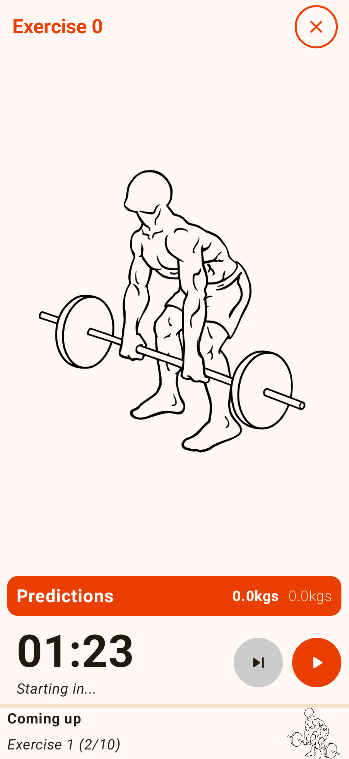

# FITCUBE

An android gym app made in Kotlin for workout sessions and real-time tracking.

## Description and features

The idea is to create an app that allows to track your workout sessions and evolution while also being able to use it while you are training.
You can play your session when you work out to keep track of your rest time between exercises, how much weight you need, how many reps you have to do, etc.
A workout session is composed of exercises that you can choose from a prebuilt list or create your own. 
You can then define how much weight and reps you want to do per exercise.

During your session, you can define a rest timer that automatically starts when you mark your series as finished. A sound tells you when the rest is done.
By clicking on the different part of the screens, you have more control on the session.
You can modify the weight of the current session if you want a precise tracking, or just update it for the next sessions.
You can also reorder the order of the exercises, skip fully or just a part of an exercise.
Moreover, you can manage most of the commands from a notification that you can access even when the app is in the background.

## Screenshots

## Things to add

- Add a support to add cardio exercises during the session
- Add exercises labeled as "warm-ups" for a special timing
- Add support for different types of exercises (especially loaded / unloaded)
- Add visualisation of previous sessions